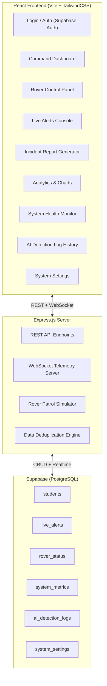
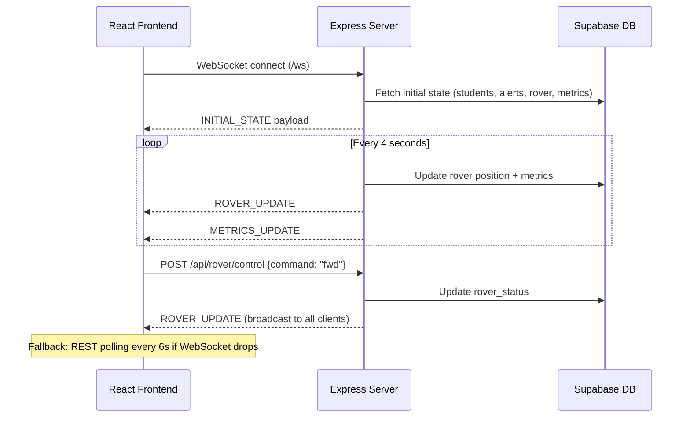

# ExamShield AI — Complete Application Overview

## 🎯 Core Concept

**ExamShield AI** is an **AI-powered autonomous exam surveillance and proctoring system** designed for universities. It combines a **ground-patrolling rover robot** equipped with cameras, RF scanners, and thermal sensors with an **AI vision pipeline** and a **real-time command-and-control dashboard** — all to detect cheating, unauthorized devices, and suspicious behavior during examinations.

Think of it as a **military-grade exam hall command center**: an operator sits at the dashboard, watching live rover telemetry, AI-flagged students, and security alerts — all streamed in real-time.

---

## 🏗️ Architecture



---

## 🔐 Authentication

- **Supabase Auth** with email/password sign-in, sign-up, and password reset ("forgot password" flow)
- Session persistence via `supabase.auth.getSession()` and `onAuthStateChange` listener
- Role-based access: **Admin**, **Exam Controller**, **Operator**, **Viewer** (Viewers get read-only controls)

---

## 📊 The 8 Main Views

### 1. **Dashboard** — Real-Time Command Center
| Feature | Detail |
|---|---|
| **Student Grid** | Live cards showing all enrolled students with photo, hall ticket, room/seat, status badge |
| **Status Categories** | `Verified Safe` (green), `Suspicious` (amber), `Device Detected` (red) |
| **Live Stats Bar** | Total students, verified count, suspicious count, device detections, active alerts |
| **Rover Telemetry Strip** | Battery %, speed, current location, mission status — all live-updating |
| **Recent Alerts Feed** | Latest critical/high/medium/low alerts with timestamps |
| **Student Search** | Filter students by name, hall ticket, branch, room |
| **Click-to-Inspect** | Click any student card → opens detailed profile modal |

### 2. **Rover Control** — Autonomous Robot Command
| Feature | Detail |
|---|---|
| **Live Camera Canvas** | HTML5 Canvas with simulated AI bounding boxes, tracking overlays, and scan lines |
| **Video Filters** | Normal / Infrared / Night-Vision toggle for the camera feed |
| **Directional Controls** | Forward, Backward, Left, Right, Stop, E-STOP, Return Home |
| **Manual/Auto Toggle** | Switch between autonomous patrol and manual operator control |
| **Telemetry Gauges** | Battery, speed, temperature, CPU usage, storage, WiFi/camera status, motor status |
| **Position Tracking** | Live X/Y coordinates of rover on the exam hall grid |
| **Mission Info** | Current mission name, estimated time remaining |

### 3. **Live Alerts Console**
| Feature | Detail |
|---|---|
| **Priority Levels** | CRITICAL (red), HIGH (orange), MEDIUM (amber), LOW (green) |
| **Alert Details** | Title, location, timestamp, action taken, status, evidence snapshot |
| **Alert Actions** | Resolve, escalate, or dismiss alerts (role-permissioned) |
| **Custom Alert Trigger** | Operators can manually fire alerts with custom title, priority, location, details |
| **Real-Time Push** | New alerts arrive via WebSocket + audio beep notification |

### 4. **Incident Report Generator**
| Feature | Detail |
|---|---|
| **Report Builder** | Select a flagged student → auto-populates violation details |
| **Custom Fields** | Violation type, rover ID, operator notes, AI evidence references |
| **Print-Ready** | Generates a formal academic violation report, print-optimized with CSS `@media print` |
| **PDF Download Sim** | Simulates PDF export with print dialog |

### 5. **Analytics Dashboard**
| Feature | Detail |
|---|---|
| **Pie Chart** | Student verification breakdown (Cleared / Suspicious / Device Confirmed) |
| **Bar Chart** | Device types detected (Smart Watches, Micro Earbuds, Smartphones, Bluetooth Beacons) |
| **Line Chart** | Hourly violation trend over exam session |
| **Battery Decay Curve** | Rover battery + temperature over patrol duration |
| **Built with Recharts** | Interactive, responsive charts |

### 6. **System Health Monitor**
| Feature | Detail |
|---|---|
| **Service Status** | Backend, AI Model, Camera, Database, Internet, Rover Connection — each with online/offline indicator |
| **Performance Gauges** | CPU %, Memory %, GPU % usage — live updating |
| **AI Inference Stats** | Model FPS, inference time (ms) |
| **Storage** | Used vs total storage on the rover |

### 7. **AI Detection Log History**
| Feature | Detail |
|---|---|
| **Chronological Feed** | Every AI detection event with timestamp, frame snapshot, detected objects, confidence %, decision |
| **Decision Color Coding** | Green (Safe), Orange (Suspicious), Red (Device Flagged) |
| **Operator Attribution** | Which system/operator triggered the detection |

### 8. **System Settings**
| Feature | Detail |
|---|---|
| **Exam Halls Config** | Manage list of monitored halls |
| **AI Threshold** | Adjust detection confidence threshold (0–100) |
| **Suspicion Threshold** | Adjust behavioral suspicion score threshold |
| **Notification Channels** | Toggle dashboard alerts, audio beeps, SMS dispatch, dean email |
| **Rover Config** | Patrol speed, thermal scan interval, optical tracking, RF jammer block |
| **Operator Management** | View/manage operator accounts and roles |
| **Theme Toggle** | Dark/Light mode switch |

---

## 🤖 The AI Detection Pipeline (Conceptual)

The application models the following detection capabilities:

| Sensor | What It Detects |
|---|---|
| **RF Scanner** | Active smart-device transmissions (smart watches, Bluetooth earbuds, phones) |
| **Thermal Imaging** | Concealed earbuds via ear thermal profile anomalies |
| **Computer Vision (Pose Estimation)** | Suspicious body language — gaze deviation, hand concealment, excessive head movement |
| **Facial Recognition** | Identity verification via RFID + face match (confidence %) |
| **Object Detection** | Unauthorized objects on desks or person |

> [!NOTE]
> The current implementation uses **simulated/seed data** for all AI detections. The server simulates rover patrol movement, battery drain, and system metric jitter via `setInterval`. A real deployment would replace these with actual hardware integrations.

---

## ⚡ Real-Time Architecture



---

## 🧱 Tech Stack

| Layer | Technology |
|---|---|
| **Frontend** | React 19, Vite 6, TailwindCSS 4 |
| **UI Libraries** | Lucide React (icons), Recharts (charts), Motion (animations) |
| **Backend** | Node.js, Express 4 |
| **Real-Time** | Native WebSocket (`ws` library) |
| **Database** | Supabase (PostgreSQL + Auth) |
| **Auth** | Supabase Auth (email/password) |
| **AI Integration** | Google GenAI SDK (`@google/genai`) — available but not yet actively used in views |
| **Styling** | TailwindCSS with dark/light theme support, glassmorphism cards |

---

## 📂 Project Structure

```
ExamShield-AI/
└── client/
    ├── server.js                    # Express + WebSocket + Simulation engine
    ├── supabase_schema.sql          # Full DB schema + seed data
    ├── package.json
    ├── vite.config.js
    ├── .env                         # Supabase credentials
    └── src/
        ├── App.jsx                  # Root: auth, routing, state, WebSocket client
        ├── main.jsx                 # React entry point
        ├── index.css                # Global styles
        ├── types.js                 # Shared type definitions
        ├── lib/
        │   └── supabase.js          # Supabase client init
        ├── context/
        │   └── AuthContext.jsx      # Auth context provider
        ├── services/
        │   └── authService.js       # Auth helper functions
        └── components/
            ├── LoginView.jsx        # Sign in / Sign up / Forgot password
            ├── Sidebar.jsx          # Navigation sidebar
            ├── DashboardView.jsx    # Main command center
            ├── RoverView.jsx        # Rover control + live camera
            ├── AlertsView.jsx       # Live alerts management
            ├── ReportsView.jsx      # Incident report builder
            ├── AnalyticsView.jsx    # Charts & analytics
            ├── HealthView.jsx       # System health monitor
            ├── HistoryView.jsx      # AI detection log timeline
            ├── SettingsView.jsx     # System configuration
            ├── StudentProfileModal.jsx  # Detailed student inspection
            └── GlassCard.jsx        # Reusable glassmorphism card
```

---

## 🗄️ Database Schema (6 Tables)

| Table | Purpose | Key Fields |
|---|---|---|
| **students** | All exam candidates | name, hallTicket, branch, room, seat, photo, status, detectedDevice, suspicionScore, faceConfidence, entryDecision, verificationHistory, violationHistory |
| **live_alerts** | Security incidents | title, priority, location, actionTaken, status, snapshot, details |
| **rover_status** | Rover telemetry (singleton) | battery, speed, location, posX/Y, manualMode, motorStatus, currentMission |
| **system_metrics** | System performance (singleton) | backend/aiModel/camera status, cpu/memory/gpu %, modelFps, inferenceTime |
| **ai_detection_logs** | AI inference history | frameUrl, detectedObjects, confidence, decision, operator, hall |
| **system_settings** | Configuration (singleton) | examHalls, aiThreshold, suspicionThreshold, notificationChannels, roverConfig, operators |

---

## 🎨 Design Philosophy

- **Military/surveillance aesthetic** with monospace fonts, uppercase labels, and status indicators
- **Glassmorphism cards** with backdrop blur and subtle borders
- **Dark mode first** with full light mode support
- **Audio feedback** — distinct beep sounds for CRITICAL vs normal alerts
- **Animated transitions** — Framer Motion for view transitions, CSS animations for loading states
- **Print-optimized** — Reports view strips UI chrome for clean printouts

---

## 📌 Current State

> [!IMPORTANT]
> This is a **fully functional prototype / university project** (v2.84). The rover patrol, AI detections, and sensor data are all **simulated on the server** with realistic seed data. The dashboard, WebSocket telemetry, authentication, and all CRUD operations against Supabase are **fully working**.

To evolve into a production system, you would need:
1. Replace simulated rover data with real hardware (ROS/MQTT bridge)
2. Integrate actual AI models (YOLOv8, MediaPipe pose, RF spectrum analyzer)
3. Add proper RBAC with Supabase RLS policies (currently set to public access)
4. Implement real video streaming (WebRTC/HLS) instead of Canvas simulation
